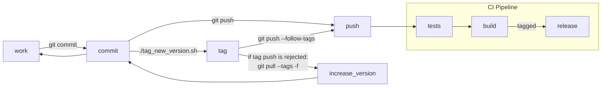

# P/A base
This repository contains models, logic and abstractions for P/A components.

There are also some models in this repository which are currently under development/evaluation.
***

## Installation of pa-base in dependent projects

### Editable "installation"
Clone the repo side-by-side with dependent projects
and just add the path to PYTHONPATH. This can easily be done in PyCharm/IntelliJ
by marking both folders (`pa-base` and the dependent project's root)
as "sources root" within the same PyCharm/IntelliJ workspace.

### Versioned installation
Versioned install can be done either from GitLab PyPI using `pip` or by
cloning the repo, checking out a version tag, building it locally
and installing the build artifact, i.e.,
```bash
# checkout specific version tag "v0.0.9"
git checkout v0.0.9
# build version 0.0.9
poetry build -f wheel

# install build artifact in target environment
pip install dist/pa-base-0.0.9-py3-none-any.whl
```

***

## Development Workflow
New features must be implemented on feature branches. Please create a merge request to
`main` when your feature is ready for rollout.

`main` is always shippable. New versions may be created from `main` at any time.



## Dev Environment
```bash
poetry install --all-extras
```
This creates a new venv. Use it either through `poetry run ...` or in a `poetry shell`.
The environment can be set in VS Code / IntelliJ using the path returned by `poetry env info`.

## Tests
Run tests locally (automatically loads environment variables from  `.env` file using python-dotenv from dev dependencies):
```bash
poetry run pytest
```
Tests run automatically in the CI pipeline.

## Releases
Releases must be tagged with a version `vX.Y.Z`, e.g., `v1.2.3`.
This is used by consumers for version pinning.
Version tags must never be changed and can only be released once.
```bash
git tag v0.0.9 -m "Version 0.0.9"
```
If poetry is installed, a correct tag can be autogenerated from the version given in `pyproject.toml`:
```bash
./tag_new_version.sh
```

***

## Maintainers
This project is maintained by the Personalization & Automation Team at ZDF.

***

## License
See [LICENSE](LICENSE).
